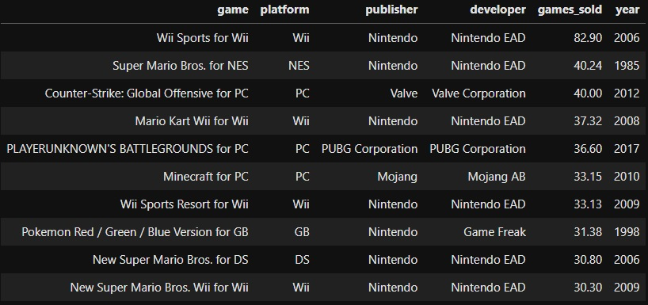
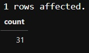
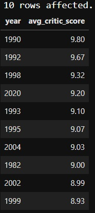
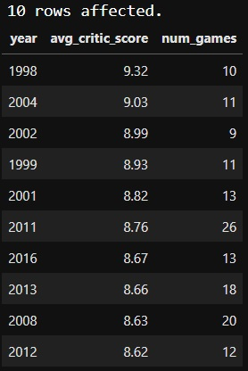
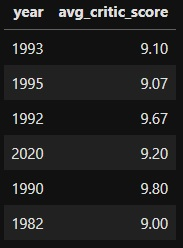
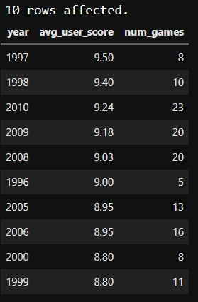
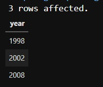
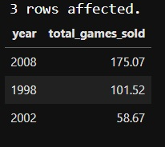

# Video games data analysis using SQL

Video games are huge business: according to Mordor Intelligence, the worldwide gaming sector will be worth more than $300 billion by 2027. With so much money on the line, large game publishers are highly motivated to develop the next big success. But are games improving, or is the golden era of video gaming passed?

In this project, we'll look at the top 400 best-selling video games from 1977 through 2020. We'll compare game sales statistics with critic and user reviews to see if video games have improved as the gaming business has increased.

<h3 id="game_sales"><code>game_sales</code></h3>
<table>
<thead>
<tr>
<th style="text-align:left;">column</th>
<th>type</th>
<th>meaning</th>
</tr>
</thead>
<tbody>
<tr>
<td style="text-align:left;"><code>game</code></td>
<td>varchar</td>
<td>Name of the video game</td>
</tr>
<tr>
<td style="text-align:left;"><code>platform</code></td>
<td>varchar</td>
<td>Gaming platform</td>
</tr>
<tr>
<td style="text-align:left;"><code>publisher</code></td>
<td>varchar</td>
<td>Game publisher</td>
</tr>
<tr>
<td style="text-align:left;"><code>developer</code></td>
<td>varchar</td>
<td>Game developer</td>
</tr>
<tr>
<td style="text-align:left;"><code>Total_Shipped</code></td>
<td>float</td>
<td>Number of copies sold (millions)</td>
</tr>
<tr>
<td style="text-align:left;"><code>year</code></td>
<td>int</td>
<td>Release year</td>
</tr>
</tbody>
</table>
<h3 id="reviews"><code>reviews</code></h3>
<table>
<thead>
<tr>
<th style="text-align:left;">column</th>
<th>type</th>
<th>meaning</th>
</tr>
</thead>
<tbody>
<tr>
<td style="text-align:left;"><code>game</code></td>
<td>varchar</td>
<td>Name of the video game</td>
</tr>
<tr>
<td style="text-align:left;"><code>critic_score</code></td>
<td>float</td>
<td>Critic score according to Metacritic</td>
</tr>
<tr>
<td style="text-align:left;"><code>user_score</code></td>
<td>float</td>
<td>User score according to Metacritic</td>
</tr>
</tbody>
</table>

Let's begin by looking at some of the top selling video games of all time!

1. The ten best-selling video games
-  Select all information for the top ten best-selling games
- Order the results from best-selling game down to tenth best-selling

> SELECT *
FROM game_sales
ORDER BY games_sold DESC
LIMIT 10;

2. Missing review scores
 - Join games_sales and reviews
- Select a count of the number of games where both critic_score and user_score are null

> SELECT
    COUNT(*)
FROM game_sales AS g
LEFT JOIN reviews AS r
    USING(game)
WHERE critic_score IS NULL AND user_score IS NULL

3. Years that video game critics loved
-  Select release year and average critic score for each year, rounded and aliased
- Join the game_sales and reviews tables
- Group by release year
- Order the data from highest to lowest avg_critic_score and limit to 10 results

> SELECT
    year,
    ROUND(AVG(critic_score), 2) AS avg_critic_score
FROM game_sales 
LEFT JOIN reviews
    USING(game)
GROUP BY year
ORDER BY avg_critic_score DESC
LIMIT 10;

4. Was 1982 really that great?
- Paste your query from the previous task; update it to add a count of games released in each year called num_games
- Update the query so that it only returns years that have more than four reviewed games

> SELECT
    year,
    ROUND(AVG(critic_score), 2) AS avg_critic_score,
    COUNT(g.game) AS num_games
FROM game_sales AS g
INNER JOIN reviews AS r
    USING(game)
GROUP BY year
HAVING COUNT(g.game) > 4
ORDER BY avg_critic_score DESC
LIMIT 10;

5. Years that dropped off the critics' favorites list
-  Select the year and avg_critic_score for those years that dropped off the list of critic favorites 
- Order the results from highest to lowest avg_critic_score

> SELECT
    year,
    avg_critic_score
FROM top_critic_years
EXCEPT
SELECT
    year,
    avg_critic_score
FROM top_critic_years_more_than_four_games

6. Years video game players loved
- Select year, an average of user_score, and a count of games released in a given year, aliased and rounded
- Include only years with more than four reviewed games; group data by year
- Order data by avg_user_score, and limit to ten results

> SELECT
    year,
    ROUND(AVG(user_score), 2) AS avg_user_score,
    COUNT(g.game) AS num_games
FROM game_sales AS g
INNER JOIN reviews AS r
    USING(game)
GROUP BY year
HAVING COUNT(g.game) > 4
ORDER BY avg_user_score DESC
LIMIT 10;

7. Years that both players and critics loved
Alright, we've got a list of the top ten years according to both critic reviews and user reviews. Are there any years that showed up on both tables? If so, those years would certainly be excellent ones! 
Recall that we have access to the top_critic_years_more_than_four_games table, which stores the results of our top critic years query from Task 4:

<h3 id="top_critic_years_more_than_four_games"><code>top_critic_years_more_than_four_games</code></h3>
<table>
<thead>
<tr>
<th style="text-align:left;">column</th>
<th>type</th>
<th>meaning</th>
</tr>
</thead>
<tbody>
<tr>
<td style="text-align:left;"><code>year</code></td>
<td>int</td>
<td>Year of video game release</td>
</tr>
<tr>
<td style="text-align:left;"><code>num_games</code></td>
<td>int</td>
<td>Count of the number of video games released in that year</td>
</tr>
<tr>
<td style="text-align:left;"><code>avg_critic_score</code></td>
<td>float</td>
<td>Average of all critic scores for games released in that year</td>
</tr>
</tbody>
</table>

We've also saved the results of our top user years query from the previous task into a table:

<h3 id="top_user_years_more_than_four_games"><code>top_user_years_more_than_four_games</code></h3>
<table>
<thead>
<tr>
<th style="text-align:left;">column</th>
<th>type</th>
<th>meaning</th>
</tr>
</thead>
<tbody>
<tr>
<td style="text-align:left;"><code>year</code></td>
<td>int</td>
<td>Year of video game release</td>
</tr>
<tr>
<td style="text-align:left;"><code>num_games</code></td>
<td>int</td>
<td>Count of the number of video games released in that year</td>
</tr>
<tr>
<td style="text-align:left;"><code>avg_user_score</code></td>
<td>float</td>
<td>Average of all user scores for games released in that year</td>
</tr>
</tbody>
</table>

-  Select the year results that appear on both tables

> SELECT 
    year
FROM top_critic_years_more_than_four_games
INTERSECT
SELECT 
    year 
FROM top_user_years_more_than_four_games
ORDER BY year

8. Sales in the best video game years
- Select year and sum of games_sold, aliased as total_games_sold; order results by total_games_sold descending
- Filter game_sales based on whether each year is in the list returned in the previous task

> SELECT
    year,
    SUM(games_sold) AS total_games_sold
FROM game_sales
WHERE year IN (SELECT 
                    year
                FROM top_critic_years_more_than_four_games
                INTERSECT
                SELECT 
                    year 
                FROM top_user_years_more_than_four_games
                )
GROUP BY year
ORDER BY total_games_sold DESC;

